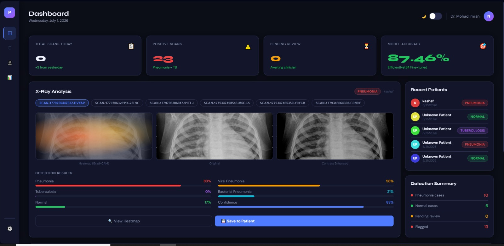
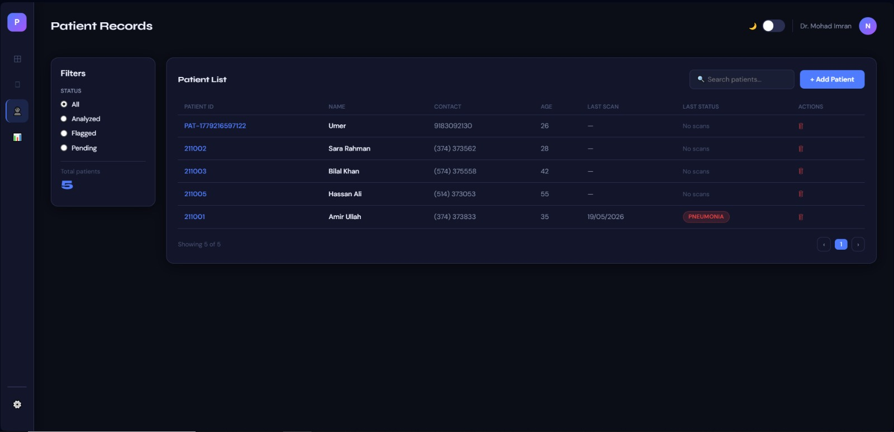
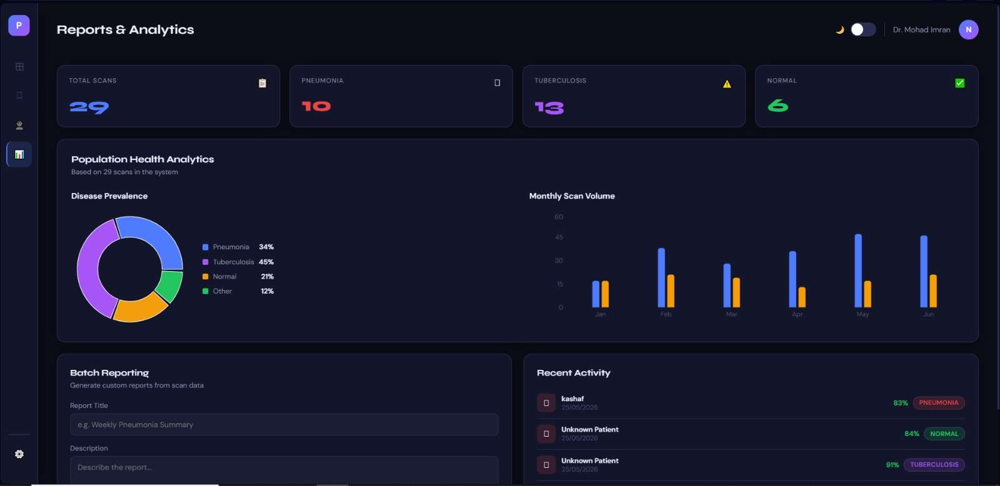
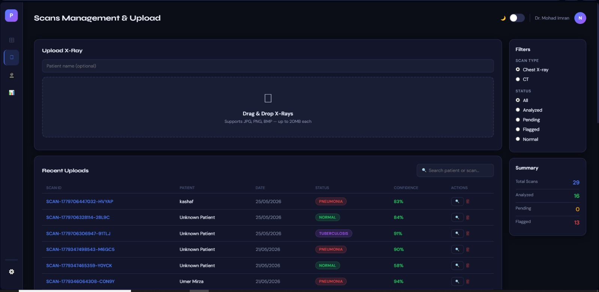
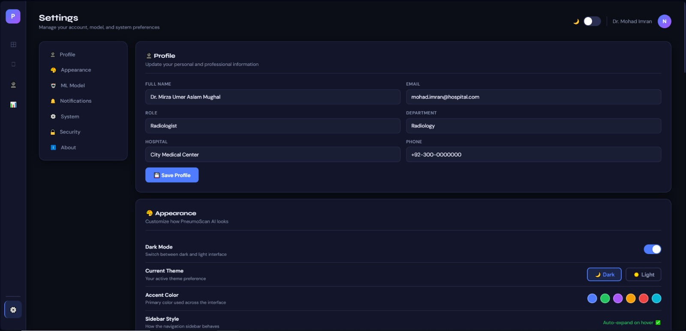

# 🩻 AI-Powered X-Ray Detection System


An AI-powered web application for detecting diseases from chest X-ray images using Deep Learning. The project combines a React frontend, Node.js backend, and Python-based AI inference to provide an end-to-end medical image analysis platform.

---

## 📌 Overview

The system allows users to upload chest X-ray images, manage patient records, and receive AI-generated predictions using a trained EfficientNetB4 model.

---

## ✨ Features

- AI-powered X-ray image analysis
- Chest disease prediction
- Patient management
- Scan management
- Dashboard with analytics
- Report generation
- RESTful API
- Modern React interface

---

## 🛠 Technology Stack

### Frontend
- React.js
- JavaScript (ES6)
- CSS3

### Backend
- Node.js
- Express.js

### Artificial Intelligence
- Python
- TensorFlow
- Keras
- OpenCV

### Database
- SQL Database

---

## 📂 Project Structure

```text
AI-Powered-Xray-Detection-System/
│
├── backend/
│   ├── database/
│   ├── middleware/
│   ├── ml_model/
│   ├── models/
│   ├── routes/
│   ├── uploads/
│   ├── .env.example
│   ├── database.py
│   ├── main.py
│   ├── package.json
│   └── server.js
│
├── frontend/
│   ├── public/
│   ├── src/
│   │   ├── components/
│   │   ├── context/
│   │   ├── pages/
│   │   ├── services/
│   │   ├── App.jsx
│   │   ├── index.css
│   │   └── index.js
│   ├── package.json
│   └── package-lock.json
│
├── ml_model/
├── ml_models/
├── ml_api.py
├── requirements.txt
├── README.md
├── LICENSE
└── start.bat
```

---

## ⚡ Quick Start

Follow these commands to set up the project after cloning the repository.

```bash
# Clone the repository
git clone https://github.com/abrashhalii/AI-Powered-X-ray-Detection-System.git

# Install backend dependencies
cd backend
npm install

# Install frontend dependencies
cd ../frontend
npm install

# Install Python dependencies
pip install -r requirements.txt

```

## 🚀 Installation

### Clone the Repository

```bash
git clone https://github.com/abrashhalii/AI-Powered-X-ray-Detection-System.git
```

### Backend

```bash
cd backend
npm install
node server.js
```

### Frontend

```bash
cd frontend
npm install
npm start
```

### Python

```bash
pip install -r requirements.txt
python ml_api.py
```

---

## 🧠 Machine Learning

The AI module includes:

- Data preprocessing
- Model training
- Cross-validation
- Bias detection
- Model evaluation
- Model monitoring

Model Architecture:

- EfficientNetB4
- TensorFlow
- Keras

---

## 📸 Screenshots


### 📊 Dashboard



---

### 👤 Patient Records



---

### 🩻 Scan Management


---

### 📈 Reports



---

### 🤖 AI Prediction



---
### 🤖 Setting



---

## 🏗️ System Architecture

```text
                    +----------------------+
                    |   React Frontend     |
                    +----------+-----------+
                               |
                               |
                        REST API Calls
                               |
                               ▼
                  +------------+------------+
                  | Node.js + Express API   |
                  +------------+------------+
                               |
                +--------------+--------------+
                |                             |
                ▼                             ▼
        SQL Database               Python AI Module
                |                             |
                ▼                             ▼
        Patient Records          EfficientNetB4 Model
        Reports                  TensorFlow/Keras
        Scan History             AI Prediction
```

---

## 🧠 AI Model Workflow

```text
Chest X-ray Image
        │
        ▼
Image Upload
        │
        ▼
Image Preprocessing
        │
        ▼
EfficientNetB4
        │
        ▼
Disease Prediction
        │
        ▼
Confidence Score
        │
        ▼
Displayed on Dashboard
```

---

## 📊 Dataset Information

The AI model was trained using chest X-ray images.

### Dataset Preparation

- Image preprocessing
- Data cleaning
- Image normalization
- Data augmentation
- Dataset splitting
- Cross-validation

### Training Pipeline

- Data Preprocessing
- Model Training
- Model Evaluation
- Bias Detection
- Model Monitoring

> **Note:** The dataset is not included in this repository because of its large size. Only the source code and notebooks are included.

## 🔮 Future Improvements

- Multi-disease classification
- Explainable AI (Grad-CAM)
- Cloud deployment
- Docker support
- User authentication with JWT
- Real-time analytics

---

## 👥 Contributors

- **Abrash Ali**
- **Harrum Fatima**

---

## 📄 License

This project is licensed under the **MIT License**.

See the **LICENSE** file for complete details.
